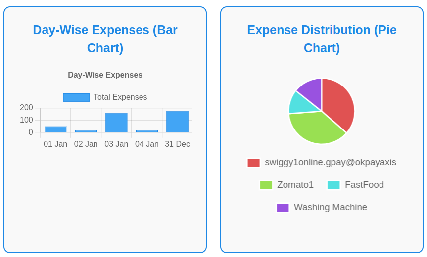

# **Online Transaction Viewer**

Easily track and manage your UPI transaction history with a single click! Our tool offers a secure, user-friendly interface to access, organize, and analyze your transactions seamlessly.

---


---

## **Interactive Statistics at Your Fingertips**

Gain valuable insights into your transaction patterns with interactive stats and visualizations.



---

## **Technology Stack**

### **Frontend**
- **Framework**: Vue.js  
- **UI Library**: Vuetify  

### **Backend**
- **Framework**: Flask  
- **APIs**: Google API (fetch data securely from your Google account)  

### **Database**
- **PostgreSQL**: For storing and updating transaction data  

---

## **Key Features**

- **Comprehensive Data Retrieval**: Access all past UPI transactions with a single click.  
- **Customizable Labels**: Rename UPI IDs for better recognition and personalization.  
- **Detailed Insights**: View total individual transactions, payment frequency, and more.  

---

## **Setup Commands**

### Connect to the Database
```bash
psql -h localhost -U webpayuser -d webpay
