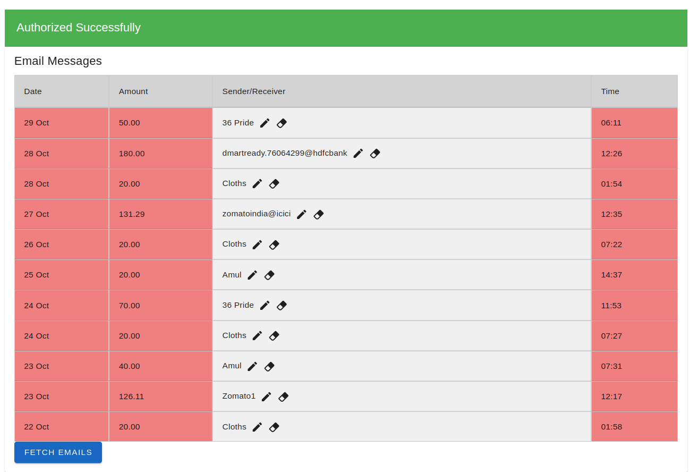

# Online Transaction Viewer

View your complete UPI transaction history with just a single click! This tool provides an easy-to-use interface to access, view, and manage your UPI transactions in a streamlined and secure way.

## Tools

- **Frontend**: Vue.js, Vuetify
- **Backend**: Flask, Google API (for fetching data from your Google account)
- **Database**: PostgreSQL for storing and updating transaction data

## Features
 
 - Get Complete Data of your Past Transactions with the click of a Button
 - Rename UPI Ids for Easy Recognition
 - Stats Showing Total Individual Transactions, Frequency of Payments and many more to come...

psql -h localhost -U webpayuser -d webpay
npm install vue-router
npm install chart.js

Clear credentails and revoke tokens before changing the Date of Fetching Transactions

  

